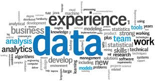

# Data Science Roadmap

 

My roadmap to study Data Science.

### Data Science Foundation Courses
| Title | Credential |
| :---: | --- | 
| Python for Data Science | [IBM](https://www.youracclaim.com/badges/cb131a9f-5c1e-42af-828c-2df4fa1637ad/linked_in_profile) | 
| Data Science Foundations - Level 1 | [IBM](https://www.youracclaim.com/badges/581e9040-23aa-49eb-ad48-742257e5e584/linked_in_profile)  |
| Data Science Foundations - Level 2  | [IBM](https://www.youracclaim.com/badges/63145b04-10e9-4024-9fc8-8c5b4ab2da5b/linked_in_profile) |
| Applied Data Science with Python - Level 2 | [IBM](https://www.youracclaim.com/badges/e4052b79-8edc-4382-91a5-dc60e3fe563b/linked_in_profile) |

### Data Science Certification
| Title | Credential |
| :---: | --- | 
| Data Science Masters Program | [GreyAtom](https://home.greyatom.com/settings/profile/certificate/4a5c66c4-0396-4c68-8c18-8eb61ffcc3f6)

### Udacity Nanodegrees
| Title | Credential |
| :---: | --- | 
| Deep Learning Nanodegree | [Udacity](https://graduation.udacity.com/confirm/GPJ63YNV)
| Data Engineering Nanodegree | [Udacity](https://confirm.udacity.com/M6A3WUU5)

### Machine learning and Deep Learning Courses
| Title | Credential |
| :---: | --- | 
| Introduction to Machine Learning | [Kaggle](https://www.kaggle.com/learn/certification/shrikantnaidu/intro-to-machine-learning) |
| Intermediate Machine Learning | [Kaggle](https://www.kaggle.com/learn/certification/shrikantnaidu/intermediate-machine-learning) |
| Feature Engineering | [Kaggle](https://www.kaggle.com/learn/certification/shrikantnaidu/feature-engineering) |
| Natural Language Processing | [Kaggle](https://www.kaggle.com/learn/certification/shrikantnaidu/natural-language-processing) | 
| Machine Learning with PySpark | [DataCamp](https://www.datacamp.com/statement-of-accomplishment/course/7c0c2d634c5a61c40ef3e8f88f74636bbee9af4e) |
| Deep Learning Fundamentals | [IBM](https://courses.cognitiveclass.ai/certificates/2106577eb2c748889b9034ee1d70312f) |
| Deep Learning | [Kaggle](https://www.kaggle.com/learn/certification/shrikantnaidu/deep-learning) |
| Introduction to Deep Learning with Keras | [DataCamp](https://www.datacamp.com/statement-of-accomplishment/course/4d5620f08ebd82acbbf1ac363161d49c87ba856d) |
| Introduction to TensorFlow in Python | [DataCamp](https://www.datacamp.com/statement-of-accomplishment/course/7800476b38442499b5a7f8228e8a6e2d4722359f) |
| AWS Machine Learning Foundation | [Udacity](https://github.com/shrikantnaidu/Data-Science-Roadmap/blob/master/Certificates/Udacity/Udacity_AWS_ML.pdf) |
| Using TensorFlow with AWS SageMaker | [Coursera](https://coursera.org/share/378fec600b92161dd3f2ffefab828519) |
| Transfer Learning for NLP with TensorFlow Hub | [Coursera](https://coursera.org/share/68bcda12450042a0a1fb1a81b0bbcd61) |
| Fine Tune BERT for Text Classification with TensorFlow | [Coursera](https://coursera.org/share/17f27b556454d83517c3c9186d152a25) |
| Tweet Emotion Recognition with TensorFlow | [Coursera](https://coursera.org/share/992651de7ed3275588b81eefe4a0a286) |
| Machine Learning Pipelines with Azure ML Studio | [Coursera](https://coursera.org/share/025e678e40a7eb105344038d7487e949) |

### SQL Courses
| Title | Credential |
| :---: | --- | 
| Introduction to SQL | [Kaggle](https://www.kaggle.com/learn/certification/shrikantnaidu/intro-to-sql) |
| Advance SQL | [Kaggle](https://www.kaggle.com/learn/certification/shrikantnaidu/advanced-sql) |

### NoSQL Courses
| Title | Credential |
| :---: | --- | 
| MongoDB Basics| [MongoDB University](http://university.mongodb.com/course_completion/1a649722-2bbe-4a12-9047-e8b9a3a1cffe) |
| MongoDB for Python Developers | [MongoDB University](https://university.mongodb.com/course_completion/625c8004-7bb7-4f7c-a112-e830434636c5) |

### DevOps Courses
| Title | Credential |
| :---: | --- | 
| DevOps for Data Scientists | [LinkedIn](https://github.com/shrikantnaidu/Data-Science-Roadmap/blob/master/Certificates/LinkedIn%20Learning/CertificateOfCompletion_Devops%20For%20Data%20Scientists.pdf) |
| Docker for Data Scientists | [LinkedIn](https://github.com/shrikantnaidu/Data-Science-Roadmap/blob/master/Certificates/LinkedIn%20Learning/CertificateOfCompletion_Docker%20For%20Data%20Scientists.pdf) |

### Analytics Courses
| Title | Credential |
| :---: | --- | 
| Google Analytics for Beginners | [Google](https://analytics.google.com/analytics/academy/certificate/rzJmdu7ZTtuhKmVVlkIu4Q) |
| Advanced Google Analytics | [Google](https://analytics.google.com/analytics/academy/certificate/bMYlNMT4Tb2H8GZZNNevjg) |

### Project Management Courses
| Title | Credential |
| :---: | --- | 
| Introduction to Project Management with ClickUp | [Coursera](https://coursera.org/share/824d20cd33bb9bfe14834c4af4d040d2) | 
| Business Analysis & Process Management | [Coursera](https://coursera.org/share/ccd15581aceed679bcb72adef40fa764) | 
